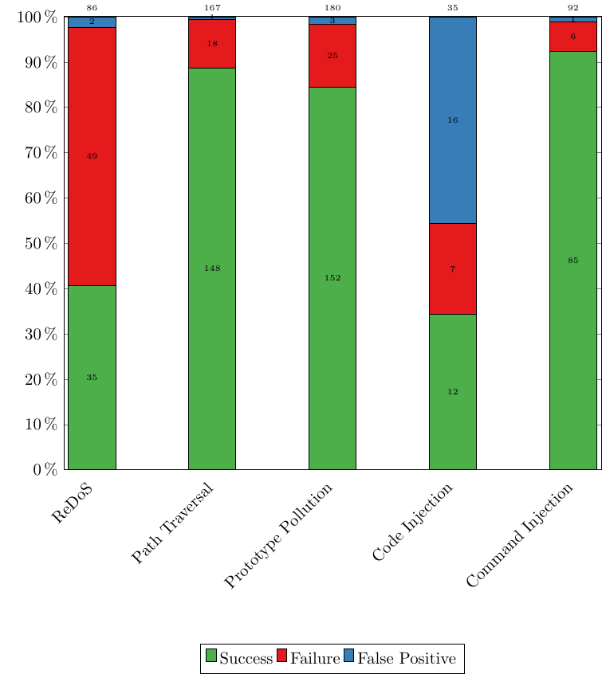
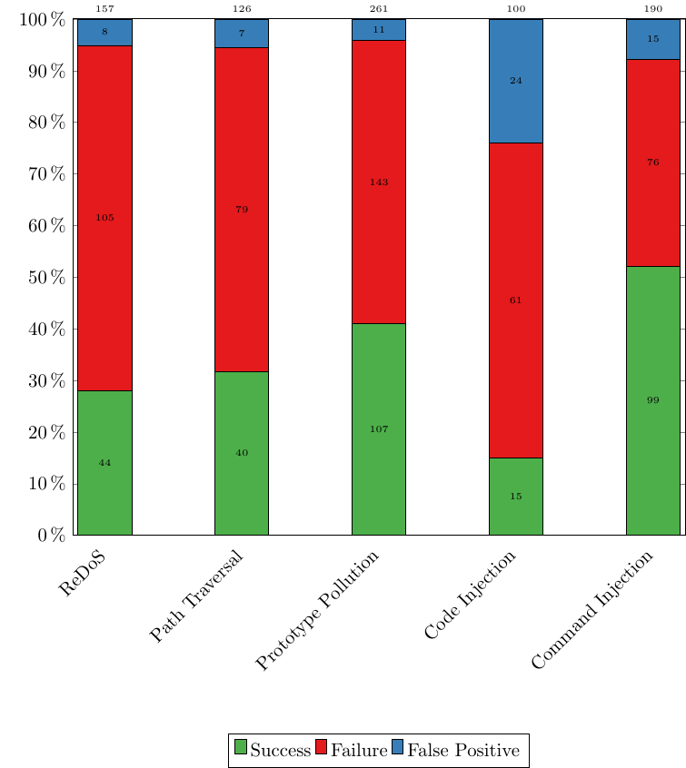

# Generating Proof-of-Concept Exploits for Vulnerable npm Packages

This repository contains a tool to generate proof-of-concept exploits for vulnerable npm packages.

### Building the Docker Image

1. Clone the repository:

```sh
$ git clone https://github.com/sola-st/master-thesis-deniz-simsek gen-poc
```

2. Install dependencies:

```sh
$ cd gen-poc
$ npm install
```

3. Build the docker images:

```sh
$ docker build -t patched_node -f patched_node.Dockerfile .
$ docker build -t gen-poc_mnt .
```

### Setup

The repository contains a wrapper script to run the tool in a docker container.
The script requires an `.env` file in the current directory with the following content:

```
OPENAI_API_KEY=sk-proj-xxx
GITHUB_API_KEY=github_pat_xxx # required for fetching GHSA-IDs
```

The only required argument is the vulnerability ID, which should be a GitHub Advisory ID or a Snyk ID.
The tool will automatically fetch the vulnerability report from the corresponding API/ scrape it from the website.

### Create a PoC for a vulnerable package

Run this script from the repository root:

```sh
$ ./run-mnt.sh output node index.js create -v GHSA-m7p2-ghfh-pjvx
```

This will create a test for [GHSA-m7p2-ghfh-pjvx](https://github.com/advisories/GHSA-m7p2-ghfh-pjvx) in
`./output/GHSA-m7p2-ghfh-pjvx/test.js`.

### Running the test

For most vulnerabilities, it is recommended to run the test using the provided docker image:

```sh
$ ./run-mnt.sh output node --test /output/<advisoryId>/test.js
```

For **ReDoS** vulnerabilities, the test should be run with the following flags:

```sh
./run-mnt.sh output node --test --enable-experimental-regexp-engine-on-excessive-backtracks --regexp-backtracks-before-fallback=30000 output/<advisoryId>/test.js
```

For vulnerabilities that involve long-running tasks (e.g. web servers), run the test with the following flags:

```sh
$ ./run-mnt.sh output node --test --test-force-exit /output/<advisoryId>/test.js
```

## Reproducing the Evaluation Results

First, follow the installation instructions above.

### RQ1: How effective is the approach?

```sh
$ ./run-mnt.sh output node index.js pipeline -v dataset/SecBench.js/*\.all
```

> Note that in our experiments, the approach was run twice (without caching prompts).

<div style="text-align: center;">
  
</div>

### RQ2: What is the impact of single components to the overall effectiveness of the approach?

The following table shows the different refiner configurations and which components are enabled or disabled.

| Refiner | Taint Path | Reference Exploits/ API Usage | ErrorRefiner | DebugRefiner | ContextRefiner |
|---------|------------|-------------------------------|--------------|--------------|----------------|
| $C_0$   | ❌          | ✅                             | ✅            | ✅            | ❌              |
| $C_1$   | ✅          | ❌                             | ✅            | ✅            | ✅              |
| $C_2$   | ✅          | ✅                             | ❌            | ✅            | ✅              |
| $C_3$   | ✅          | ✅                             | ✅            | ❌            | ✅              |
| $C_4$   | ✅          | ✅                             | ✅            | ✅            | ❌              |

A refiner can be specified using `--refiner <refiner>`, where `<refiner>` is one of the following values: `C0Refiner`,
`C1Refiner`, `C2Refiner`, `C3Refiner`, `C4Refiner`.

### RQ3: How efficient is the approach in terms of cost and time?

To reproduce the results for RQ3, run the following command:

```sh
$ ./run-mnt.sh output node index.js pipeline -v dataset/SecBench.js/*\.all
```

### RQ4: How well does the approach generalize to newer vulnerabilities?

```sh
$ ./run-mnt.sh output node index.js pipeline -v dataset/CWEBench.js/*\.all
```

<div style="text-align: center;">
  
</div>
